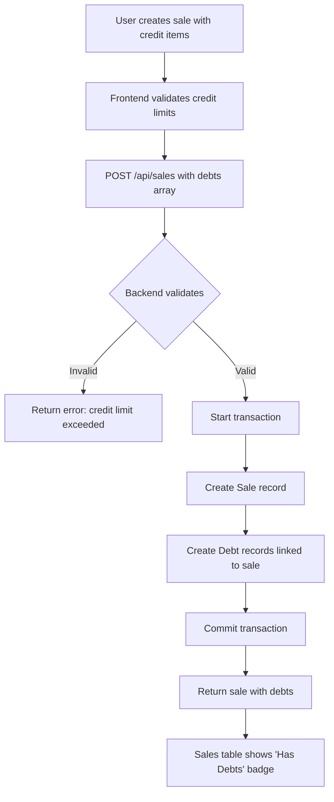
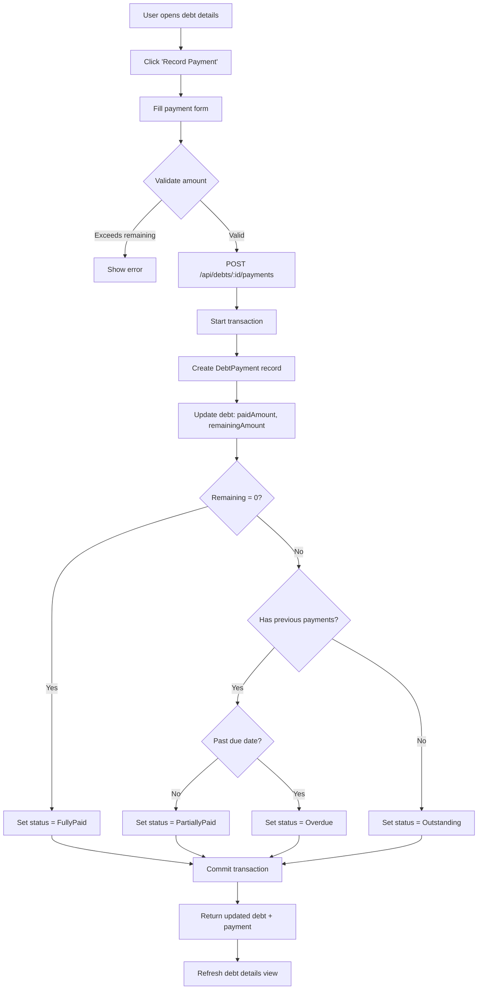
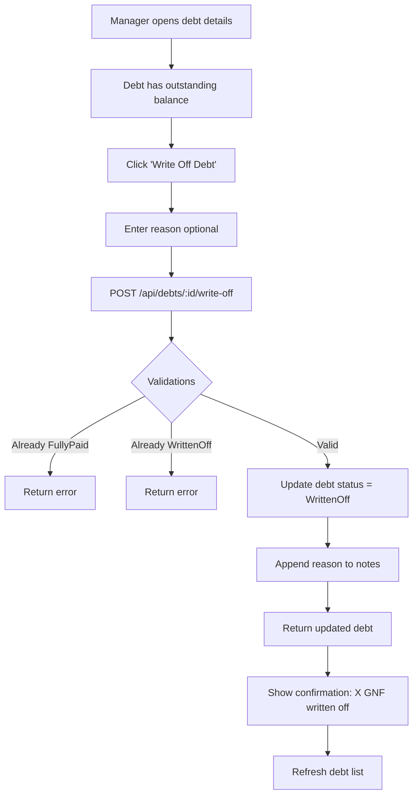

# Debt Feature Analysis & Integration with Sales

**Date**: January 20, 2026
**Analysis**: Comprehensive review of debt management system and sales integration

---

## Executive Summary

The debt feature is **fully implemented at the backend API level** but **lacks frontend UI** for debt management. While debts are created automatically through credit sales and displayed in the sales table, there is **no dedicated page or interface** to:
- View all debts across customers
- Record payments on debts
- Track payment history
- Write off bad debts
- Filter/search debts by status, customer, or date

**Key Finding**: The backend infrastructure is robust and production-ready, but requires frontend components to make it usable.

---

## Architecture Overview

### Database Schema (Prisma)

#### Customer Model
```prisma
model Customer {
  id             String          @id @default(uuid())
  restaurantId   String
  restaurant     Restaurant      @relation(fields: [restaurantId], references: [id])
  name           String
  phone          String?
  email          String?
  address        String?
  company        String?
  customerType   CustomerType    @default(Individual)
  creditLimit    Float?          // Maximum outstanding debt allowed
  notes          String?
  isActive       Boolean         @default(true)
  debts          Debt[]          // One-to-many relationship
  debtPayments   DebtPayment[]   // All payments made by this customer
  createdAt      DateTime        @default(now())
  updatedAt      DateTime        @updatedAt
}

enum CustomerType {
  Individual
  Corporate
  Wholesale
}
```

#### Debt Model
```prisma
model Debt {
  id                String        @id @default(uuid())
  restaurantId      String
  restaurant        Restaurant    @relation(fields: [restaurantId], references: [id])
  saleId            String?       // Optional: links to sale if created from credit sale
  sale              Sale?         @relation(fields: [saleId], references: [id])
  customerId        String
  customer          Customer      @relation(fields: [customerId], references: [id])

  principalAmount   Float         // Original debt amount
  paidAmount        Float         @default(0)  // Total paid so far
  remainingAmount   Float         // principalAmount - paidAmount

  dueDate           DateTime?     // Optional payment deadline
  status            DebtStatus    @default(Outstanding)

  description       String?       // What the debt is for
  notes             String?       // Internal notes

  createdBy         String        // User ID who created the debt
  createdByName     String?
  createdAt         DateTime      @default(now())
  updatedAt         DateTime      @updatedAt

  payments          DebtPayment[] // One-to-many: payment history

  @@index([restaurantId])
  @@index([saleId])
  @@index([customerId])
  @@index([status])
  @@index([dueDate])
  @@index([restaurantId, status])
}

enum DebtStatus {
  Outstanding      // No payments made yet
  PartiallyPaid   // Some payments made, balance remains
  FullyPaid       // Completely paid off
  Overdue         // Past due date with balance remaining
  WrittenOff      // Bad debt, uncollectible
}
```

#### DebtPayment Model
```prisma
model DebtPayment {
  id              String        @id @default(uuid())
  restaurantId    String
  restaurant      Restaurant    @relation(fields: [restaurantId], references: [id])
  debtId          String
  debt            Debt          @relation(fields: [debtId], references: [id], onDelete: Cascade)
  customerId      String
  customer        Customer      @relation(fields: [customerId], references: [id])

  amount          Float         // Payment amount
  paymentMethod   String        // Cash, Orange Money, Card, etc.
  paymentDate     DateTime      // When payment was received

  receiptNumber   String?       // Optional receipt reference
  notes           String?       // Payment notes

  receivedBy      String        // User ID who recorded the payment
  receivedByName  String?
  createdAt       DateTime      @default(now())

  @@index([restaurantId])
  @@index([debtId])
  @@index([customerId])
  @@index([paymentDate])
}
```

---

## Backend API Endpoints (Complete)

### 1. `/api/debts` - List & Create Debts

#### GET /api/debts
**Purpose**: List debts with filtering options

**Query Parameters**:
- `restaurantId` (required): Filter by restaurant
- `customerId` (optional): Filter by customer
- `status` (optional): Filter by status (Outstanding, PartiallyPaid, FullyPaid, Overdue, WrittenOff)
- `saleId` (optional): Filter by associated sale
- `overdue` (optional): Boolean to show only overdue debts

**Response**:
```json
{
  "debts": [
    {
      "id": "debt-uuid",
      "restaurantId": "restaurant-uuid",
      "saleId": "sale-uuid",
      "customerId": "customer-uuid",
      "principalAmount": 50000,
      "paidAmount": 20000,
      "remainingAmount": 30000,
      "dueDate": "2026-02-01T00:00:00.000Z",
      "status": "PartiallyPaid",
      "description": "Credit sale - 3 baguettes",
      "notes": null,
      "createdBy": "user-uuid",
      "createdByName": "John Doe",
      "createdAt": "2026-01-15T10:00:00.000Z",
      "updatedAt": "2026-01-18T14:30:00.000Z",
      "customer": {
        "id": "customer-uuid",
        "name": "Mamadou Diallo",
        "phone": "+224 XXX XX XX XX",
        "email": "mamadou@example.com",
        "customerType": "Individual"
      },
      "sale": {
        "id": "sale-uuid",
        "date": "2026-01-15T00:00:00.000Z",
        "totalGNF": 50000
      },
      "payments": [
        {
          "id": "payment-uuid",
          "amount": 20000,
          "paymentMethod": "Cash",
          "paymentDate": "2026-01-18T00:00:00.000Z",
          "receiptNumber": "RCP-001",
          "receivedByName": "Jane Smith",
          "createdAt": "2026-01-18T14:30:00.000Z"
        }
      ],
      "_count": {
        "payments": 1
      }
    }
  ]
}
```

**Access Control**:
- Authentication required
- User must have access to the specified restaurant

#### POST /api/debts
**Purpose**: Create a new debt (not linked to a sale)

**Request Body**:
```json
{
  "restaurantId": "restaurant-uuid",
  "customerId": "customer-uuid",
  "principalAmount": 100000,
  "dueDate": "2026-02-15",  // Optional
  "description": "Manual debt entry",
  "notes": "Customer requested credit for bulk purchase"
}
```

**Validations**:
- `restaurantId` is required
- `customerId` is required
- `principalAmount` must be > 0
- Customer must exist and belong to restaurant
- Credit limit enforcement (if customer has creditLimit set)
- User must be Manager or Editor role

**Credit Limit Check** ([app/api/debts/route.ts:202-232](app/api/debts/route.ts#L202-L232)):
```typescript
if (customer.creditLimit !== null && customer.creditLimit !== undefined) {
  // Calculate current outstanding debt
  const existingDebts = await prisma.debt.findMany({
    where: {
      customerId: body.customerId,
      status: { in: ['Outstanding', 'PartiallyPaid', 'Overdue'] }
    },
    select: { remainingAmount: true }
  })

  const currentOutstanding = existingDebts.reduce(
    (sum, debt) => sum + debt.remainingAmount,
    0
  )

  const newTotalOutstanding = currentOutstanding + body.principalAmount

  if (newTotalOutstanding > customer.creditLimit) {
    return NextResponse.json({
      error: `Credit limit exceeded. Customer limit: ${customer.creditLimit} GNF, Current outstanding: ${currentOutstanding} GNF, New total would be: ${newTotalOutstanding} GNF`
    }, { status: 400 })
  }
}
```

---

### 2. `/api/debts/[id]` - Get, Update, Delete Specific Debt

#### GET /api/debts/[id]
**Purpose**: Get detailed debt information with full payment history

**Response**:
```json
{
  "debt": {
    "id": "debt-uuid",
    "restaurantId": "restaurant-uuid",
    "saleId": "sale-uuid",
    "customerId": "customer-uuid",
    "principalAmount": 50000,
    "paidAmount": 20000,
    "remainingAmount": 30000,
    "dueDate": "2026-02-01T00:00:00.000Z",
    "status": "PartiallyPaid",
    "description": "Credit sale - 3 baguettes",
    "notes": null,
    "createdBy": "user-uuid",
    "createdByName": "John Doe",
    "createdAt": "2026-01-15T10:00:00.000Z",
    "updatedAt": "2026-01-18T14:30:00.000Z",
    "customer": {
      "id": "customer-uuid",
      "name": "Mamadou Diallo",
      "phone": "+224 XXX XX XX XX",
      "email": "mamadou@example.com",
      "address": "Conakry, Guinea",
      "company": null,
      "customerType": "Individual",
      "creditLimit": 200000
    },
    "sale": {
      "id": "sale-uuid",
      "date": "2026-01-15T00:00:00.000Z",
      "totalGNF": 50000,
      "cashGNF": 0,
      "orangeMoneyGNF": 0,
      "cardGNF": 0,
      "status": "Approved"
    },
    "payments": [
      {
        "id": "payment-uuid",
        "amount": 20000,
        "paymentMethod": "Cash",
        "paymentDate": "2026-01-18T00:00:00.000Z",
        "receiptNumber": "RCP-001",
        "notes": "Partial payment",
        "receivedBy": "user-uuid",
        "receivedByName": "Jane Smith",
        "createdAt": "2026-01-18T14:30:00.000Z"
      }
    ]
  }
}
```

#### PUT /api/debts/[id]
**Purpose**: Update debt details (Manager only)

**Request Body**:
```json
{
  "principalAmount": 60000,  // Can be updated
  "dueDate": "2026-02-20",   // Can be updated
  "description": "Updated description",
  "notes": "Added notes"
}
```

**Validations**:
- Manager role required
- Cannot set `principalAmount` lower than already `paidAmount`
- Updates `remainingAmount` automatically when `principalAmount` changes

**Example Validation** ([app/api/debts/[id]/route.ts:166-174](app/api/debts/[id]/route.ts#L166-L174)):
```typescript
// Ensure new principal amount is not less than already paid amount
if (body.principalAmount < existingDebt.paidAmount) {
  return NextResponse.json({
    error: `Cannot set principal amount (${body.principalAmount} GNF) lower than already paid amount (${existingDebt.paidAmount} GNF)`
  }, { status: 400 })
}
```

#### DELETE /api/debts/[id]
**Purpose**: Delete debt (Manager only, only if no payments)

**Validations**:
- Manager role required
- Cannot delete debt with payments (must delete payments first or use write-off)

**Prevention Logic** ([app/api/debts/[id]/route.ts:301-309](app/api/debts/[id]/route.ts#L301-L309)):
```typescript
if (existingDebt.payments.length > 0) {
  return NextResponse.json({
    error: `Cannot delete debt with ${existingDebt.payments.length} payment(s). Please delete payments first or use write-off.`
  }, { status: 400 })
}
```

---

### 3. `/api/debts/[id]/payments` - Payment Management

#### GET /api/debts/[id]/payments
**Purpose**: List all payments for a specific debt

**Response**:
```json
{
  "payments": [
    {
      "id": "payment-uuid",
      "restaurantId": "restaurant-uuid",
      "debtId": "debt-uuid",
      "customerId": "customer-uuid",
      "amount": 20000,
      "paymentMethod": "Cash",
      "paymentDate": "2026-01-18T00:00:00.000Z",
      "receiptNumber": "RCP-001",
      "notes": "Partial payment",
      "receivedBy": "user-uuid",
      "receivedByName": "Jane Smith",
      "createdAt": "2026-01-18T14:30:00.000Z"
    }
  ]
}
```

#### POST /api/debts/[id]/payments
**Purpose**: Record a payment on a debt

**Request Body**:
```json
{
  "amount": 20000,
  "paymentMethod": "Cash",  // Required: Cash, Orange Money, Card, etc.
  "paymentDate": "2026-01-18",  // Required
  "receiptNumber": "RCP-001",  // Optional
  "notes": "Partial payment received"  // Optional
}
```

**Validations**:
- Editor or Manager role required
- `amount` must be > 0
- `amount` cannot exceed `remainingAmount`
- `paymentMethod` is required
- `paymentDate` is required
- Cannot record payment on written-off debts

**Atomic Transaction** ([app/api/debts/[id]/payments/route.ts:170-250](app/api/debts/[id]/payments/route.ts#L170-L250)):
```typescript
const result = await prisma.$transaction(async (tx) => {
  // 1. Create payment record
  const payment = await tx.debtPayment.create({
    data: {
      restaurantId: debt.restaurantId,
      debtId: id,
      customerId: debt.customerId,
      amount: body.amount,
      paymentMethod: body.paymentMethod.trim(),
      paymentDate: new Date(body.paymentDate),
      receiptNumber: body.receiptNumber?.trim() || null,
      notes: body.notes?.trim() || null,
      receivedBy: session.user.id,
      receivedByName: user.name || null
    }
  })

  // 2. Calculate new debt amounts
  const newPaidAmount = debt.paidAmount + body.amount
  const newRemainingAmount = debt.principalAmount - newPaidAmount

  // 3. Determine new status
  let newStatus: 'Outstanding' | 'PartiallyPaid' | 'FullyPaid' | 'Overdue'
  if (newRemainingAmount === 0) {
    newStatus = 'FullyPaid'
  } else if (newPaidAmount > 0) {
    // Check if overdue
    if (debt.dueDate && new Date(debt.dueDate) < new Date()) {
      newStatus = 'Overdue'
    } else {
      newStatus = 'PartiallyPaid'
    }
  } else {
    newStatus = 'Outstanding'
  }

  // 4. Update debt
  const updatedDebt = await tx.debt.update({
    where: { id },
    data: {
      paidAmount: newPaidAmount,
      remainingAmount: newRemainingAmount,
      status: newStatus
    },
    include: { /* ... */ }
  })

  return { payment, debt: updatedDebt }
})
```

**Key Features**:
- Atomic transaction ensures data consistency
- Automatic status updates based on payment amount
- Tracks who received the payment
- Prevents overpayment

---

### 4. `/api/debts/[id]/write-off` - Write Off Bad Debt

#### POST /api/debts/[id]/write-off
**Purpose**: Mark debt as uncollectible bad debt (Manager only)

**Request Body**:
```json
{
  "reason": "Customer relocated, unable to collect"  // Optional
}
```

**Validations**:
- Manager role required
- Cannot write off already fully paid debt
- Cannot write off already written-off debt

**Write-off Logic** ([app/api/debts/[id]/write-off/route.ts:87-128](app/api/debts/[id]/write-off/route.ts#L87-L128)):
```typescript
const debt = await prisma.debt.update({
  where: { id },
  data: {
    status: 'WrittenOff',
    notes: body.reason
      ? `${existingDebt.notes ? existingDebt.notes + '\n\n' : ''}Write-off reason: ${body.reason.trim()}`
      : existingDebt.notes
  },
  include: { /* ... */ }
})

return NextResponse.json({
  debt,
  message: `Debt written off successfully. Remaining amount of ${existingDebt.remainingAmount} GNF marked as bad debt.`
})
```

**Important Notes**:
- Write-off does NOT delete the debt (preserves audit trail)
- Status changes to `WrittenOff`
- Reason is appended to notes
- Remaining amount stays unchanged (for reporting purposes)
- No further payments can be recorded on written-off debts

---

## Integration with Sales

### How Credit Sales Create Debts

When a sale is created with credit items ([app/api/sales/route.ts:322-385](app/api/sales/route.ts#L322-L385)):

```typescript
const result = await prisma.$transaction(async (tx) => {
  // 1. Create sale
  const sale = await tx.sale.create({
    data: {
      restaurantId,
      date: saleDate,
      totalGNF,  // Includes cash + Orange Money + card + credit
      cashGNF,
      orangeMoneyGNF,
      cardGNF,
      // ... other fields
    }
  })

  // 2. Create debts if any credit items
  if (debts.length > 0) {
    await tx.debt.createMany({
      data: debts.map((debt: any) => ({
        restaurantId,
        saleId: sale.id,  // Links debt to sale
        customerId: debt.customerId,
        principalAmount: debt.amountGNF,
        paidAmount: 0,
        remainingAmount: debt.amountGNF,
        dueDate: debt.dueDate ? new Date(debt.dueDate) : null,
        status: 'Outstanding',
        description: debt.description?.trim() || null,
        notes: debt.notes?.trim() || null,
        createdBy: session.user.id,
        createdByName: user?.name || null
      }))
    })
  }

  // 3. Return sale with debts
  return saleWithRelations
})
```

### How Sales Display Debt Status

Sales table shows debt information ([components/sales/SalesTable.tsx:220-242](components/sales/SalesTable.tsx#L220-L242)):

```tsx
<td className="px-6 py-4 text-center">
  {sale.activeDebtsCount && sale.activeDebtsCount > 0 ? (
    <div
      className="inline-flex flex-col items-center gap-1 cursor-help"
      title={`${sale.activeDebtsCount} customer${sale.activeDebtsCount > 1 ? 's' : ''} with outstanding credit`}
    >
      <span className="inline-flex items-center px-2.5 py-0.5 rounded-full text-xs font-medium bg-amber-100 text-amber-800 dark:bg-amber-900/30 dark:text-amber-400">
        Has Debts ({sale.activeDebtsCount})
      </span>
      {sale.outstandingDebtAmount && sale.outstandingDebtAmount > 0 && (
        <span className="text-xs text-amber-700 dark:text-amber-400 font-medium">
          {formatCurrency(sale.outstandingDebtAmount)}
        </span>
      )}
    </div>
  ) : (
    <span
      className="inline-flex items-center px-2.5 py-0.5 rounded-full text-xs font-medium bg-green-100 text-green-800 dark:bg-green-900/30 dark:text-green-400 cursor-help"
      title="All payments received in cash, card, or mobile money"
    >
      Fully Paid
    </span>
  )}
</td>
```

**Data Source**: Sales API returns `activeDebtsCount` and `outstandingDebtAmount` per sale ([app/api/sales/route.ts:93-98](app/api/sales/route.ts#L93-L98)):

```typescript
const sales = salesData.map(sale => ({
  ...sale,
  activeDebtsCount: sale.debts.length,
  outstandingDebtAmount: sale.debts.reduce((sum, debt) => sum + debt.remainingAmount, 0)
}))
```

---

## Customer Management & Debt Display

### CustomersTab Component

Shows outstanding debt per customer ([components/admin/CustomersTab.tsx:351-366](components/admin/CustomersTab.tsx#L351-L366)):

```tsx
<td className="px-4 py-3 text-sm">
  {customer.outstandingDebt && customer.outstandingDebt > 0 ? (
    <div>
      <div className="font-medium text-amber-700 dark:text-amber-400">
        {formatCurrency(customer.outstandingDebt)}
      </div>
      {customer.activeDebtsCount && customer.activeDebtsCount > 0 && (
        <div className="text-xs text-gray-500">
          {customer.activeDebtsCount} active {customer.activeDebtsCount === 1 ? 'debt' : 'debts'}
        </div>
      )}
    </div>
  ) : (
    <span className="text-green-600 dark:text-green-400 text-xs">-</span>
  )}
</td>
```

**Data Source**: Customers API should calculate outstanding debt (needs verification if implemented)

---

## Missing Frontend Components

### 1. **Debts Page** (`/app/finances/debts/page.tsx`) - **NOT IMPLEMENTED**

**What's Missing**:
- List all debts across all customers
- Filter by:
  - Status (Outstanding, PartiallyPaid, FullyPaid, Overdue, WrittenOff)
  - Customer
  - Date range
  - Overdue only
- Sort by:
  - Due date
  - Amount
  - Customer name
  - Status
- Search functionality
- Summary cards:
  - Total outstanding debt
  - Total overdue debt
  - Number of customers with debt
  - Written-off debt total

**Recommended Structure**:
```
/finances/debts
├── Debt summary cards
├── Filters (status, customer, date range)
├── Debts table
│   ├── Customer name
│   ├── Principal amount
│   ├── Paid amount
│   ├── Remaining amount
│   ├── Due date (with overdue indicator)
│   ├── Status badge
│   └── Actions (View Details, Record Payment)
└── Quick actions
    ├── Create manual debt
    └── View overdue debts
```

### 2. **Debt Details Modal/Page** - **NOT IMPLEMENTED**

**What's Missing**:
- View full debt details
- Payment history timeline
- Record payment form
- Update debt details (Manager only)
- Write-off debt (Manager only)
- Link to associated sale (if exists)
- Customer details sidebar

### 3. **Record Payment Modal** - **NOT IMPLEMENTED**

**What's Missing**:
```tsx
interface RecordPaymentFormData {
  amount: number
  paymentMethod: 'Cash' | 'Orange Money' | 'Card' | 'Bank Transfer'
  paymentDate: Date
  receiptNumber?: string
  notes?: string
}
```

**Features Needed**:
- Amount input with validation (max = remainingAmount)
- Payment method dropdown
- Payment date picker (default: today)
- Optional receipt number
- Optional notes
- Show remaining balance after payment
- Confirmation message

### 4. **Customer Debt Details in Customers Tab** - **PARTIALLY IMPLEMENTED**

**What Exists**:
- Shows `outstandingDebt` total
- Shows `activeDebtsCount`

**What's Missing**:
- Click-through to view customer's debt list
- Quick payment recording
- Debt history for customer

---

## Key Workflows

### Workflow 1: Create Credit Sale → Debt Created



### Workflow 2: Record Payment on Debt



### Workflow 3: Write Off Bad Debt



---

## Security & Access Control

### Role-Based Permissions

| Action | Editor | Manager |
|--------|--------|---------|
| View debts | ✅ | ✅ |
| Create debt (manual) | ✅ | ✅ |
| Create debt (via credit sale) | ✅ | ✅ |
| Record payment | ✅ | ✅ |
| Update debt details | ❌ | ✅ |
| Delete debt | ❌ | ✅ |
| Write off debt | ❌ | ✅ |

### Restaurant Access Validation

All debt API endpoints verify:
```typescript
const userRestaurant = await prisma.userRestaurant.findUnique({
  where: {
    userId_restaurantId: {
      userId: session.user.id,
      restaurantId: debt.restaurantId
    }
  }
})

if (!userRestaurant) {
  return NextResponse.json(
    { error: 'Access denied to this restaurant' },
    { status: 403 }
  )
}
```

### Credit Limit Enforcement

**Two-layer validation**:
1. **Frontend** ([components/sales/AddEditSaleModal.tsx:218-226](components/sales/AddEditSaleModal.tsx#L218-L226)):
   - Real-time validation as user types
   - Shows available credit
   - Prevents form submission if exceeded

2. **Backend** ([app/api/sales/route.ts:283-311](app/api/sales/route.ts#L283-L311)):
   - Re-validates on server (security)
   - Calculates current outstanding across ALL active debts
   - Returns detailed error message if exceeded

---

## Recommendations

### Priority 1: Debts Management Page (CRITICAL)

**File**: `app/finances/debts/page.tsx`

**Features**:
1. List all debts with filters
2. Summary analytics cards
3. Quick payment recording
4. Status badges with color coding
5. Overdue indicator

**Why Critical**: Users can create debts through sales but have NO way to manage them after creation.

### Priority 2: Debt Details Modal/Page (HIGH)

**File**: `components/debts/DebtDetailsModal.tsx`

**Features**:
1. Full debt information
2. Payment history timeline
3. Record payment form
4. Customer information sidebar
5. Link to associated sale

**Why High**: Users need to track payment history and record subsequent payments.

### Priority 3: Record Payment Modal (HIGH)

**File**: `components/debts/RecordPaymentModal.tsx`

**Features**:
1. Payment amount input
2. Payment method selection
3. Receipt number entry
4. Validation against remaining amount
5. Success confirmation

**Why High**: Core functionality for debt collection workflow.

### Priority 4: Customer Debt View (MEDIUM)

**Enhancement**: `components/admin/CustomersTab.tsx`

**Features**:
1. Click customer debt amount to see debt list
2. Modal or sidebar showing customer's debts
3. Quick payment recording per debt

**Why Medium**: Nice-to-have for customer-focused debt tracking.

### Priority 5: Debt Analytics (LOW)

**Features**:
1. Total outstanding debt trend chart
2. Collection rate (paid vs principal)
3. Overdue debt aging report
4. Customer debt ranking

**Why Low**: Useful but not essential for day-to-day operations.

---

## Testing Recommendations

### Backend API Testing (via Postman/curl)

1. **Test Credit Limit Enforcement**:
   ```bash
   # Create customer with 100k limit
   POST /api/customers
   { "name": "Test", "creditLimit": 100000 }

   # Create 80k debt - should succeed
   POST /api/debts
   { "customerId": "...", "principalAmount": 80000 }

   # Try to create another 50k debt - should fail (exceeds limit)
   POST /api/debts
   { "customerId": "...", "principalAmount": 50000 }
   ```

2. **Test Payment Recording**:
   ```bash
   # Record 30k payment on 80k debt
   POST /api/debts/:id/payments
   { "amount": 30000, "paymentMethod": "Cash", "paymentDate": "2026-01-20" }

   # Verify status changed to PartiallyPaid
   GET /api/debts/:id
   # Should show: paidAmount=30000, remainingAmount=50000, status=PartiallyPaid

   # Try to pay more than remaining - should fail
   POST /api/debts/:id/payments
   { "amount": 60000, "paymentMethod": "Cash", "paymentDate": "2026-01-20" }
   ```

3. **Test Write-off**:
   ```bash
   # Write off debt with remaining balance
   POST /api/debts/:id/write-off
   { "reason": "Customer relocated" }

   # Verify status = WrittenOff
   GET /api/debts/:id

   # Try to record payment - should fail
   POST /api/debts/:id/payments
   { "amount": 10000, "paymentMethod": "Cash", "paymentDate": "2026-01-20" }
   ```

4. **Test Overdue Status**:
   ```bash
   # Create debt with past due date
   POST /api/debts
   { "customerId": "...", "principalAmount": 50000, "dueDate": "2026-01-10" }

   # Fetch overdue debts
   GET /api/debts?restaurantId=...&overdue=true
   ```

### Frontend Testing (Once Implemented)

1. Create credit sale with multiple customers
2. Verify debts appear in debts list
3. Record partial payment
4. Verify status updates
5. Complete payment
6. Verify status = FullyPaid
7. Test credit limit warnings

---

## Data Integrity Checks

### Invariants to Maintain

1. **Debt amounts**:
   - `remainingAmount = principalAmount - paidAmount` (always)
   - `paidAmount = SUM(payments.amount)` (always)

2. **Status consistency**:
   - `status = FullyPaid` ⟺ `remainingAmount = 0`
   - `status = PartiallyPaid` ⟺ `paidAmount > 0 AND remainingAmount > 0 AND NOT overdue`
   - `status = Overdue` ⟺ `remainingAmount > 0 AND dueDate < NOW()`
   - `status = WrittenOff` ⟹ No further payments allowed

3. **Credit limit**:
   - `SUM(customer.debts.remainingAmount WHERE status IN [Outstanding, PartiallyPaid, Overdue]) <= customer.creditLimit`

### Potential Data Issues to Monitor

1. **Orphaned debts**: Debts with deleted customers (prevented by foreign key)
2. **Inconsistent amounts**: Manual updates bypassing payment API
3. **Stale overdue status**: Debts past due date but status not Overdue
4. **Exceeded credit limits**: Manual debt creation bypassing validation

---

## Summary

### ✅ What's Working

1. **Complete backend API** with robust validation
2. **Atomic transactions** ensure data consistency
3. **Credit limit enforcement** at both frontend and backend
4. **Debt creation through credit sales** works seamlessly
5. **Sales table shows debt status** with counts and amounts
6. **Customer list shows outstanding debt** per customer

### ❌ What's Missing

1. **No dedicated debts page** to view/manage debts
2. **No payment recording UI** (API exists, UI missing)
3. **No debt details view** (payment history, etc.)
4. **No write-off UI** for bad debt management
5. **No overdue debt notifications** or alerts
6. **No debt analytics/reporting** dashboard

### 🎯 Next Steps

1. **Immediate**: Build debts management page (`app/finances/debts/page.tsx`)
2. **Short-term**: Create payment recording modal
3. **Medium-term**: Add debt details view and analytics
4. **Long-term**: Implement automated overdue reminders

---

**Status**: Backend complete, frontend pending
**Recommendation**: Prioritize debts page implementation to unlock full debt management capabilities
